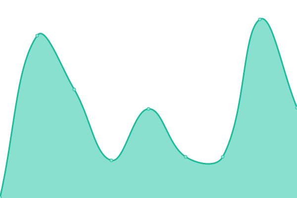

# [📈 Live Status](https://status.ayphu.com): <!--live status--> **Todos los sistemas están operativos**

This repository contains the open-source uptime monitor and status page for [Ayphu](https://ayphu.com), powered by [Upptime](https://github.com/upptime/upptime).

With [Upptime](https://upptime.js.org), you can get your own unlimited and free uptime monitor and status page, powered entirely by a GitHub repository. We use [Issues](https://github.com/ayphu/upptime/issues) as incident reports, [Actions](https://github.com/ayphu/upptime/actions) as uptime monitors, and [Pages](https://status.ayphu.com) for the status page.

<!--start: status pages-->
<!-- This summary is generated by Upptime (https://github.com/upptime/upptime) -->
<!-- Do not edit this manually, your changes will be overwritten -->
<!-- prettier-ignore -->
| URL | Status | History | Response Time | Uptime |
| --- | ------ | ------- | ------------- | ------ |
|  [Ayphu](https://ayphu.com) | Activo | [ayphu.yml](https://github.com/ayphu/upptime/commits/HEAD/history/ayphu.yml) | 

 96ms
     
 | 

<a href="https://status.ayphu.com/history/ayphu">100.00%</a>
    

|  [Panel de control](https://app.ayphu.com) | Activo | [panel-de-control.yml](https://github.com/ayphu/upptime/commits/HEAD/history/panel-de-control.yml) | 

 140ms
     
 | 

<a href="https://status.ayphu.com/history/panel-de-control">100.00%</a>
    

|  [Documentación](https://docs.ayphu.com) | Activo | [documentacion.yml](https://github.com/ayphu/upptime/commits/HEAD/history/documentacion.yml) | 

 92ms
     
 | 

<a href="https://status.ayphu.com/history/documentacion">100.00%</a>
    

<!--end: status pages-->

[**Visit our status website →**](https://status.ayphu.com)

## 📄 License

- Powered by: [Upptime](https://github.com/upptime/upptime)
- Code: [MIT](./LICENSE) © [Ayphu](https://ayphu.com)
- Data in the `./history` directory: [Open Database License](https://opendatacommons.org/licenses/odbl/1-0/)
